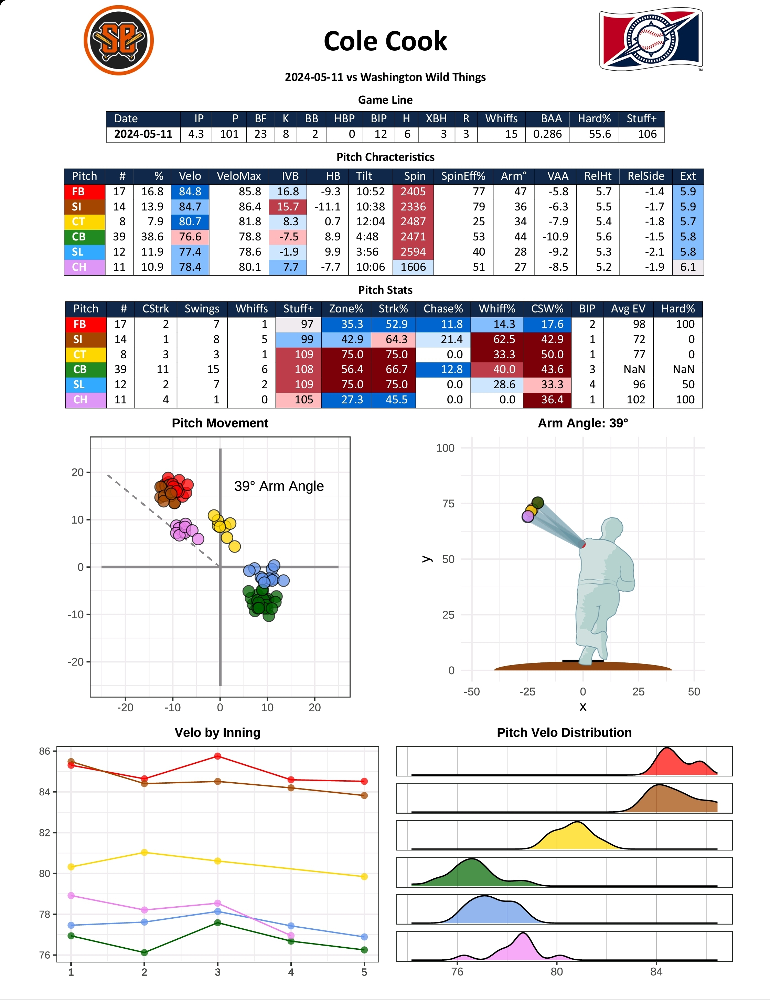
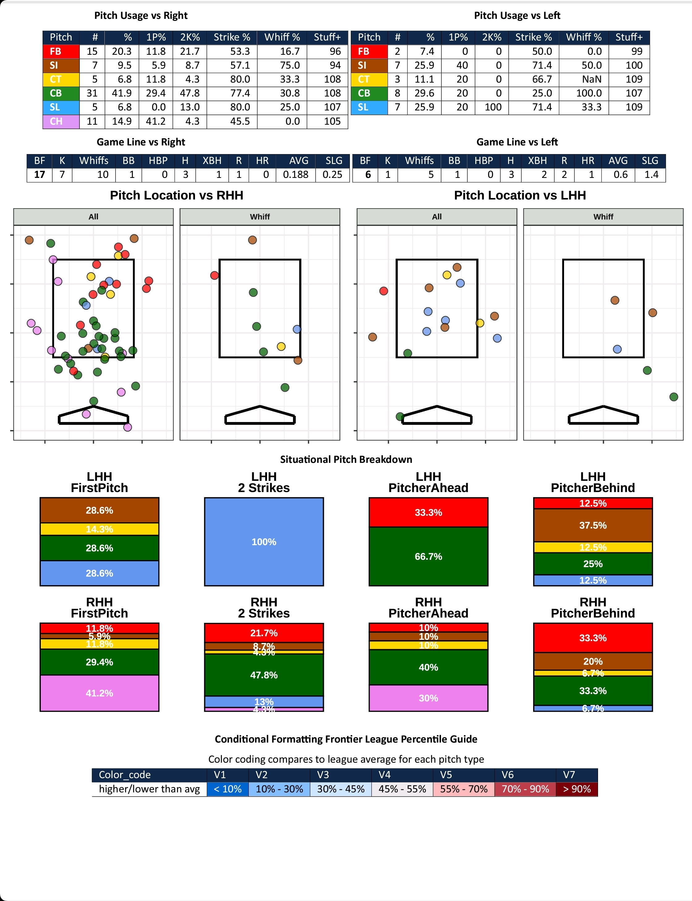

# Postgame Pitcher Report
This code is to help people create postgame pitcher reports from Trackman/Yakkertech data.
The sample csv v2 has a lot more columns thant a usual TM/YT csv. This is because the sample data is coming straight from my Frontier League database which already has a lot of the transformations and columns built in.

### More data
If you plug and play this code with your data, you'll need to calculate the following columns:
 - arm_angle, arm_angle_180, arm_angle_savant - [which you can find here!](https://github.com/tony-baseball/Pitcher-Arm-Angles)
   - this also needs pitcher height & from there you will get shoulder position (estimated)
 - in_zone - is the pitch located in the zone
 - total_bases - single * 1, double *2, etc.
 - hardhit - batted ball 95 mph+
 - whiff - PitchCall == StrikeSwinging
 - swing - PitchCall %in% c(StrikeSwinging, Foul, InPlay, etc.)
 - tj_stuff_plus (I derived Frontier League Stuff+ by calculating the run_value for each event, and then using [TJStats model!](https://github.com/tnestico/tjstuff_plus)

### More notes
- The quantiles summary table is dynamically caluclated every day, but here it is a statis RDS file for the user to use as a template. But if you have your league's data, you can calculate the quantiles for the necessary columns.

# Sample Report

